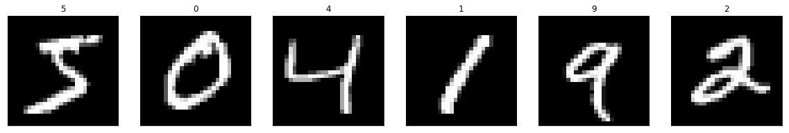
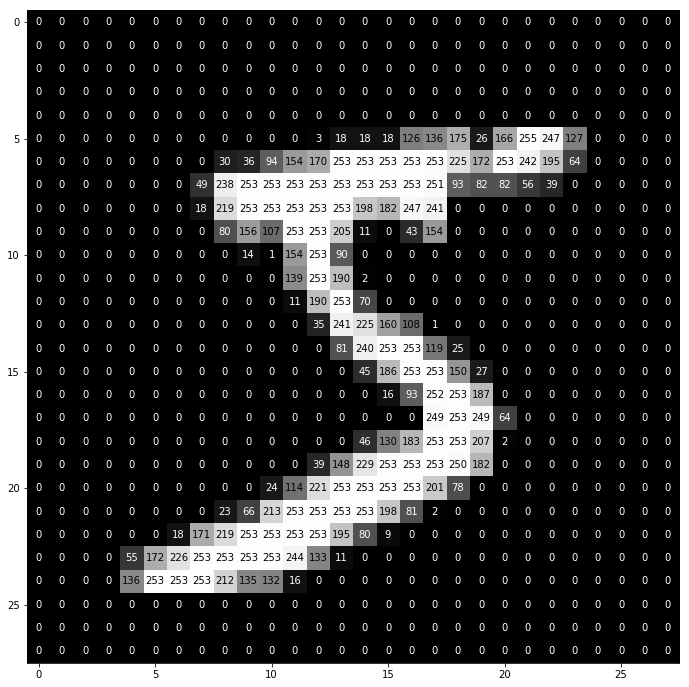

# Character Recognition on MNIST dataset
---

## Below are the steps to classify images from the MNIST database using MLP (multi-layer-perceptrons)

### 1. Load MNIST Database

The MNIST database has a training set of 60000 examples.
The MNIST database has a test set of 10000 examples.
    

### 2. Visualize the First Six Training Images

### 3. View an Image in More Detail

### 4. Rescale the Images by Dividing Every Pixel in Every Image by 255

### 5. Encode Categorical Integer Labels Using a One-Hot Scheme

    Integer-valued labels:
    [5 0 4 1 9 2 1 3 1 4]
    One-hot labels:
    [[ 0.  0.  0.  0.  0.  1.  0.  0.  0.  0.]
     [ 1.  0.  0.  0.  0.  0.  0.  0.  0.  0.]
     [ 0.  0.  0.  0.  1.  0.  0.  0.  0.  0.]
     [ 0.  1.  0.  0.  0.  0.  0.  0.  0.  0.]
     [ 0.  0.  0.  0.  0.  0.  0.  0.  0.  1.]
     [ 0.  0.  1.  0.  0.  0.  0.  0.  0.  0.]
     [ 0.  1.  0.  0.  0.  0.  0.  0.  0.  0.]
     [ 0.  0.  0.  1.  0.  0.  0.  0.  0.  0.]
     [ 0.  1.  0.  0.  0.  0.  0.  0.  0.  0.]
     [ 0.  0.  0.  0.  1.  0.  0.  0.  0.  0.]]
    

### 6. Define the Model Architecture

    _________________________________________________________________
    Layer (type)                 Output Shape              Param #   
    =================================================================
    flatten_2 (Flatten)          (None, 784)               0         
    _________________________________________________________________
    dense_4 (Dense)              (None, 512)               401920    
    _________________________________________________________________
    dropout_3 (Dropout)          (None, 512)               0         
    _________________________________________________________________
    dense_5 (Dense)              (None, 512)               262656    
    _________________________________________________________________
    dropout_4 (Dropout)          (None, 512)               0         
    _________________________________________________________________
    dense_6 (Dense)              (None, 10)                5130      
    =================================================================
    Total params: 669,706
    Trainable params: 669,706
    Non-trainable params: 0
    _________________________________________________________________
    

### 7. Compile the Model

### 8. Calculate the Classification Accuracy on the Test Set (Before Training)

    Test accuracy: 10.4700%
    

### 9. Train the Model

    Train on 48000 samples, validate on 12000 samples
    Epoch 1/10
    47744/48000 [============================>.] - ETA: 0s - loss: 0.2862 - acc: 0.9113Epoch 00001: val_loss improved from inf to 0.13708, saving model to mnist.model.best.hdf5
    48000/48000 [==============================] - 12s 248us/step - loss: 0.2856 - acc: 0.9116 - val_loss: 0.1371 - val_acc: 0.9577
    Epoch 2/10
    47872/48000 [============================>.] - ETA: 0s - loss: 0.1159 - acc: 0.9643Epoch 00002: val_loss improved from 0.13708 to 0.10251, saving model to mnist.model.best.hdf5
    48000/48000 [==============================] - 11s 222us/step - loss: 0.1160 - acc: 0.9643 - val_loss: 0.1025 - val_acc: 0.9702
    Epoch 3/10
    47744/48000 [============================>.] - ETA: 0s - loss: 0.0820 - acc: 0.9751Epoch 00003: val_loss improved from 0.10251 to 0.09112, saving model to mnist.model.best.hdf5
    48000/48000 [==============================] - 11s 230us/step - loss: 0.0819 - acc: 0.9751 - val_loss: 0.0911 - val_acc: 0.9748
    Epoch 4/10
    47744/48000 [============================>.] - ETA: 0s - loss: 0.0641 - acc: 0.9809Epoch 00004: val_loss improved from 0.09112 to 0.08469, saving model to mnist.model.best.hdf5
    48000/48000 [==============================] - 11s 229us/step - loss: 0.0639 - acc: 0.9810 - val_loss: 0.0847 - val_acc: 0.9778
    Epoch 5/10
    47872/48000 [============================>.] - ETA: 0s - loss: 0.0523 - acc: 0.9843Epoch 00005: val_loss did not improve
    48000/48000 [==============================] - 11s 237us/step - loss: 0.0522 - acc: 0.9844 - val_loss: 0.0875 - val_acc: 0.9780
    Epoch 6/10
    47744/48000 [============================>.] - ETA: 0s - loss: 0.0440 - acc: 0.9866Epoch 00006: val_loss did not improve
    48000/48000 [==============================] - 12s 240us/step - loss: 0.0441 - acc: 0.9866 - val_loss: 0.1056 - val_acc: 0.9764
    Epoch 7/10
    47872/48000 [============================>.] - ETA: 0s - loss: 0.0384 - acc: 0.9882Epoch 00007: val_loss did not improve
    48000/48000 [==============================] - 11s 236us/step - loss: 0.0383 - acc: 0.9882 - val_loss: 0.0988 - val_acc: 0.9773
    Epoch 8/10
    47744/48000 [============================>.] - ETA: 0s - loss: 0.0353 - acc: 0.9890Epoch 00008: val_loss did not improve
    48000/48000 [==============================] - 11s 238us/step - loss: 0.0354 - acc: 0.9890 - val_loss: 0.0950 - val_acc: 0.9812
    Epoch 9/10
    47744/48000 [============================>.] - ETA: 0s - loss: 0.0296 - acc: 0.9907Epoch 00009: val_loss did not improve
    48000/48000 [==============================] - 12s 242us/step - loss: 0.0295 - acc: 0.9908 - val_loss: 0.1026 - val_acc: 0.9797
    Epoch 10/10
    47872/48000 [============================>.] - ETA: 0s - loss: 0.0275 - acc: 0.9915Epoch 00010: val_loss did not improve
    48000/48000 [==============================] - 11s 232us/step - loss: 0.0275 - acc: 0.9915 - val_loss: 0.1113 - val_acc: 0.9792
    

### 10. Load the Model with the Best Classification Accuracy on the Validation Set

### 11. Calculate the Classification Accuracy on the Test Set

    Test accuracy: 97.9500%
    
